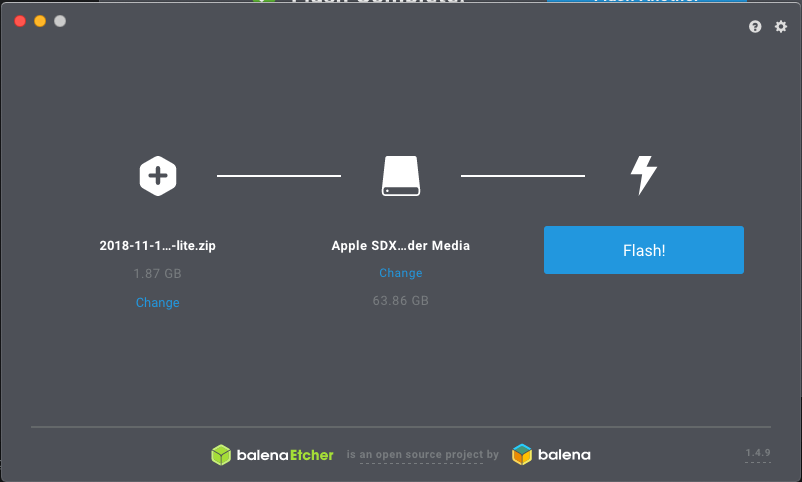

# Introduction

The installation is a two-step process: We need to setup the hardware and then we need to setup the software. The following instructions are designed to get **Mikapod Soil** working on the **Raspberry Pi**.

# Setup Raspbian Operating System
Please note these instructions were made from MacOS.

1. Start by downloading a copy of ``Raspbian`` from [the following link](https://www.raspberrypi.org/downloads/raspbian/). It is recommended to download the **Raspbian Stretch Lite** version.

2. Open up the app [Balena Etcher](https://www.balena.io/etcher/?ref=etcher_footer) and write the OS image to the SD card. If you've set everything up properly, you should see something like this:

    

3. Click start and you should see something like this.

    

4. Click start and you should see something like this.

    

5. Afterwords eject the SD Card and insert it into the ``Raspberry Pi``.

6. On your monitor you should see the login prompt. This means you have successfully setup ``Raspbian``.

    

7. Login using the following credentials:

        Username: pi
        Password: raspberry

8. Once you have successfully logged in, run the following command to enable ``SSH`` daemon. You will be able to remotely log into the ``raspberrypi`` from your computer afterwords.

        $ sudo systemctl enable ssh
        $ sudo systemctl start ssh

9. Update the software.

        $ sudo apt-get upgrade
        $ sudo apt-get update
        $ sudo apt-get install libssl-dev

# Configure Wifi

1. Check to see what USB devices are connected to your **Raspberry Pi**.

        $ lsusb

2. The output you would get would look something like this. From the list you should see seomthing like ``WLAN Adapter``, this is good! This is our Wifi.

        Bus 001 Device 004: ID 0bda:8178 Realtek Semiconductor Corp. RTL8192CU 802.11n WLAN Adapter
        Bus 001 Device 003: ID 0424:ec00 Standard Microsystems Corp. SMSC9512/9514 Fast Ethernet Adapter
        Bus 001 Device 002: ID 0424:9514 Standard Microsystems Corp. SMC9514 Hub
        Bus 001 Device 001: ID 1d6b:0002 Linux Foundation 2.0 root hub

3. Next run the command to scan all the available wifi signals.

        $ sudo iwlist wlan0 scan

4. Search through the list of sign until you find the one you are looking for and write down the details somewhere. Please look at the ``ESSID`` line to find the name of the WIFI endpoint you are using.

5. Next, open ``wpa_supplicant.conf``:

        $ sudo vi /etc/wpa_supplicant/wpa_supplicant.conf

6. Append the file with the following contents - please change to suite your needs:

        network={
            ssid="SSID"
            psk="WIFI PASSWORD"
        }

7. Wireless connectivity should start immediately; if not, use

        $ sudo ifdown wlan0
        $ sudo ifup wlan0

8. Now disconnect the ethernet cable and restart the **Raspberry Pi** using the following command:

        $ sudo reboot

9. (Optional) Now while you are running on your **MacOS** computer, run the following code which scan all the connect computers on the network. Once the command was run, look through and find the IP address of the **Raspberry Pi**.

        $ arp -a

10. This may involve random guessing, but write the following command and change the IP address until you find the correct device.

        $ ssh -l pi 192.160.0.29

11. If you finally find the correct one, congradulations! Your **Raspberry Pi** now has support for wifi.

Special Thanks:

* https://www.makeuseof.com/tag/setup-wi-fi-bluetooth-raspberry-pi-3/

# Setup Python 3
We want to support ``python3``.

1. Run the following to install the pre-requisites.

        $ sudo apt-get install build-essential checkinstall
        $ sudo apt-get install libreadline-gplv2-dev libssl-dev libncursesw5-dev libsqlite3-dev tk-dev libgdbm-dev libc6-dev libbz2-dev

2. Download and unzip ``Python3``.

        $ cd /usr/src
        $ sudo wget https://www.python.org/ftp/python/3.6.0/Python-3.6.0.tgz
        $ sudo tar xzf Python-3.6.0.tgz

3. Compile and install ``Python3``.

        $ sudo -s
        $ cd /usr/src/Python-3.6.0
        $ bash configure
        $ make altinstall
        $ exit

# Setup Third Party Libraries

1. Install ``pip`` for ``Python3``.

        $ sudo apt-get install python3-pip

2. Install ``git``.

        $ sudo apt install git

3. Install ``virtualenv``.

        $ sudo apt install virtualenv

4. Install our generic USB library.

        $ sudo apt install libusb-1.0-0-dev

# Setup our application
Finally we are ready to install and setup our application!

1. Before you begin, make sure you are logged in as the root user over ``SSH`` and **Wifi**. The command to run from your ``OS X`` computer is as follows (please replace the IP address with the IP address set by your wifi-router):

        $ ssh -l pi 192.160.0.29

2. Run the following commands to setup our script which will get our project.

        $ cd ~/
        $ git clone https://github.com/mikaponics/mikapod-soil-rpi.git
        $ cd mikapod-soil-rpi

3. You are ready to install the services. All services run as independent applications and they all communicate to each other using `Pyro4` RPC library. Before we setup and run our applications we need to setup the **RPC Nameservice**.

## Setup Nameserver
We are using the ``Pyro4`` library which will connect all the applications. Follow these instructions to begin setting up the RPC nameserver.

1. Run the following.

        $ cd ~/mikapod-soil

2. Setup our virtual environment

        $ virtualenv -p python3.6 env

3. Now lets activate virtual environment

        $ source env/bin/activate

4. Install the ``Python`` dependencies.

        $(env) pip install Pyro4                         # Distrubted objects library.

5. Run the following command and keep the console window open. We are running this code to confirm our code works

        $(env) python -m Pyro4.naming
